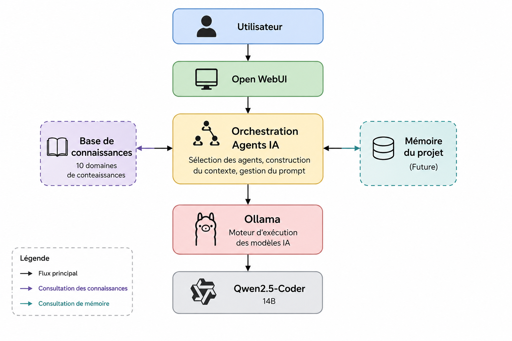

# AI Studio

## Présentation

AI Studio est une plateforme locale d'ingénierie logicielle assistée par intelligence artificielle.

Son objectif est de reproduire le fonctionnement d'une équipe de développement logiciel grâce à plusieurs agents IA spécialisés collaborant autour d'un projet commun.

Chaque agent possède un domaine d'expertise (analyse métier, architecture, développement, sécurité, qualité, documentation...) et s'appuie sur une base de connaissances commune afin de produire des livrables cohérents tout au long du cycle de vie d'un projet logiciel.

---

## Architecture de la plateforme


# Objectifs

AI Studio a pour objectif de :

* accompagner la conception de projets logiciels ;
* assister l'analyse des besoins métier ;
* proposer des architectures adaptées ;
* participer au développement backend et frontend ;
* améliorer la qualité logicielle ;
* intégrer les bonnes pratiques DevOps et sécurité ;
* produire une documentation technique structurée ;
* constituer progressivement une mémoire propre à chaque projet.

---

# Fonctionnement

Le fonctionnement général repose sur plusieurs étapes :

```text
Expression du besoin
        │
        ▼
Analyse métier
        │
        ▼
Conception de l'architecture
        │
        ▼
Développement
        │
        ▼
Tests et validation
        │
        ▼
Déploiement
        │
        ▼
Documentation
```

Chaque étape est prise en charge par un ou plusieurs agents spécialisés.

---

# Équipe d'agents IA

La plateforme est composée de neuf agents spécialisés :

* Product Owner / Business Analyst Senior
* Research Analyst Senior
* Architecte Logiciel Senior
* Backend Developer Senior
* Frontend Developer Senior
* DevOps Engineer Senior
* QA Engineer Senior
* Security Engineer Senior
* Technical Writer / Documentation Engineer

Les agents collaborent afin de transformer un besoin utilisateur en une solution logicielle complète.

---

# Base de connaissances

Les agents s'appuient sur une base de connaissances générale composée de plusieurs domaines d'expertise :

* Méthodologie Projet Logiciel
* Analyse Métier et Besoins
* Architecture
* Développement Backend
* Développement Frontend
* Bases de Données
* DevOps et Infrastructure
* Sécurité Applicative
* Tests et Qualité Logicielle
* Documentation Technique

Ces connaissances sont indépendantes des technologies et peuvent être utilisées pour accompagner différents types de projets logiciels.

---

# Architecture technique

La plateforme repose actuellement sur :

| Domaine          | Technologie       |
| ---------------- | ----------------- |
| Interface IA     | Open WebUI        |
| Moteur IA        | Ollama            |
| Modèle IA        | Qwen2.5-Coder 14B |
| Conteneurisation | Docker            |
| Documentation    | Markdown          |
| IDE              | IntelliJ IDEA     |

---

# Évolution du projet

AI Studio est conçu pour évoluer progressivement.

Les prochaines évolutions prévues comprennent notamment :

* mémoire projet ;
* architecture RAG ;
* base de données relationnelle ;
* base de données vectorielle ;
* collaboration avancée entre agents ;
* enrichissement automatique des connaissances ;
* intégration Git ;
* automatisation des workflows.

---

# Documentation

La documentation du projet est disponible dans le dossier :

```text
docs/
```

Elle comprend notamment :

* présentation du projet ;
* architecture ;
* organisation des agents ;
* pipeline DevOps ;
* installation de la plateforme.

---

# Statut du projet

Projet en cours de développement.

La plateforme évolue progressivement afin de devenir un environnement local d'ingénierie logicielle assistée par une équipe d'agents IA spécialisés.
